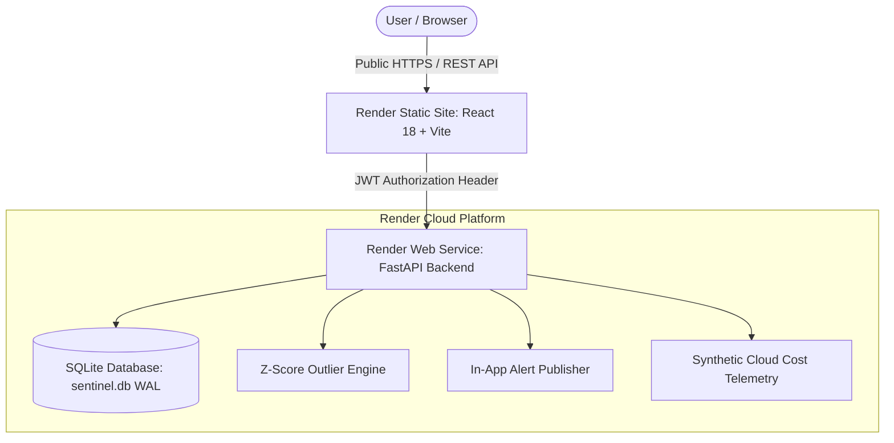

# CloudWatch Sentinel – Cloud Cost Monitoring & Anomaly Detection Platform

**CloudWatch Sentinel** is an enterprise-grade, cloud-independent cost monitoring, telemetry visualization, and statistical anomaly detection platform designed for modern cloud infrastructure.

Developed for the course **Cloud Application and Development** at **Kumaraguru College of Technology (KCT)**, this project is fully deployed on the **Render Cloud Platform** (Render Web Service + Render Static Site) and features a modern, dark SaaS observability interface, self-contained JWT authentication, SQLite persistence with WAL mode, and a Z-score statistical cost spike detection engine.

---

## 👨‍💻 Project Team (Kumaraguru College of Technology)

| Student Name | Roll Number | Engineering Role |
| :--- | :--- | :--- |
| **Dinakar S** | **24BCS405** | Lead Software Architect & Full Stack Engineer |
| **Kabileshwara Y** | **24BCS411** | Senior Cloud Architect & Backend Engineer |
| **Pranesh Sachin M** | **24BCS415** | Senior DevOps & Security Engineer |
| **Santhosh TMA** | **24BCS247** | Data Analytics & QA Engineer |
| **Nikhil R** | **24BCS190** | UI/UX & Frontend Engineer |

---

## 🎯 Problem Statement & Core Objectives

Cloud infrastructure expenses can unexpectedly surge due to misconfigured auto-scaling groups, unoptimized database queries, runaway serverless executions, or unmapped storage expansion. Traditional billing dashboards often notify cloud operators days after a budget threshold has already been breached.

**CloudWatch Sentinel** resolves this challenge by:
1. **Continuous Telemetry Monitoring**: Aggregating daily spend metrics across Compute, Storage, Database, Network, API, and Telemetry services.
2. **Statistical Outlier Detection**: Utilizing population Z-score standard deviation calculations ($Z = \frac{X - \mu}{\sigma}$) to detect cost spikes in real-time.
3. **Automated Severity Classification**: Classifying anomalies into `CRITICAL`, `HIGH`, `MEDIUM`, and `LOW` tiers.
4. **Proactive In-App Alerting**: Logging instant alert notifications for immediate analyst review.
5. **Zero-Cost Cloud Deployment**: Deployed on Render's Free Tier with zero AWS credentials or billable cloud dependencies required.

---

## 🏛 System Architecture



---

## 🛠 Technology Stack

- **Frontend**: React 18, TypeScript 5, Vite 5, Recharts 2, Dark SaaS CSS Design System
- **Backend API**: Python 3.11+, FastAPI, Uvicorn ASGI Server, Pydantic validation
- **Database Engine**: Auto-Initialized SQLite Repository (`sentinel.db`) with `PRAGMA journal_mode=WAL`
- **Security & Auth**: HMAC-SHA256 JWT Token Authentication, SHA-256 password hashing with salt, CORS protection
- **Deployment Platform**: Render Free Tier (`render.yaml` Blueprint)
- **Containerization**: Docker, Docker Compose

---

## 🚀 Quick Start & Local Development

### 1. Backend Server Setup
```powershell
# Install backend Python dependencies
pip install -r backend/requirements.txt

# Start FastAPI Uvicorn ASGI server
python -m uvicorn backend.main:app --host 0.0.0.0 --port 8000
```
*Backend runs at: `http://localhost:8000` (Health check: `http://localhost:8000/health`)*

### 2. Frontend Application Setup
```powershell
cd frontend
npm install
npm run dev
```
*Frontend runs at: `http://localhost:5173`*

### 3. Run Backend Test Suite
```powershell
python -m pytest
```
*(All 21 backend tests pass 100%)*

### 4. Run Frontend Quality Checks & Build
```powershell
cd frontend
npm run lint
npx tsc -b
npm run build
```

---

## 🔌 API Endpoints Summary

| Method | Endpoint | Description | Auth Required |
| :--- | :--- | :--- | :--- |
| `GET` | `/health` | Live system health check (`{"status": "healthy"}`) | No |
| `POST` | `/register` | Registers user profile and returns JWT ID token | No |
| `POST` | `/login` | Authenticates credentials and returns JWT token | No |
| `POST` | `/confirm-registration` | Confirms account registration code | No |
| `POST` | `/connect-account` | Saves demo cloud account IAM role configuration | Yes |
| `GET` | `/dashboard` | Aggregates period spend, active anomalies, recent trend | Yes |
| `GET` | `/cost-history` | Returns daily spend history across 6 service categories | Yes |
| `GET` | `/anomalies` | Lists all detected anomalies with baseline and Z-score | Yes |
| `GET` | `/alerts` | Returns in-app anomaly notification alerts | Yes |
| `POST` | `/demo/generate-cost` | Triggers cost spike simulation & Z-score evaluation | Yes |
| `POST` | `/anomaly-preview` | Stateless Z-score calculation preview | No |

---

## 📊 Statistical Anomaly Detection Engine

The anomaly detection engine evaluates daily spend records per cloud service category using population standard deviation:

$$Z = \frac{X - \mu}{\sigma}$$

- **$X$**: Recorded daily spend amount ($ USD)
- **$\mu$ (mu)**: Rolling baseline mean spend across historical observations
- **$\sigma$ (sigma)**: Population standard deviation

### Severity Classification Rules:
- **`CRITICAL`**: $Z \ge 4.0$ (or standard deviation is 0 with a spike)
- **`HIGH`**: $3.0 \le Z < 4.0$
- **`MEDIUM`**: $2.0 \le Z < 3.0$
- **`LOW`**: $Z < 2.0$

---

## 📢 Data Source Disclosure & Transparency

> [!NOTE]
> **SIMULATED CLOUD COST DATA PROVIDER:**
> Current deployment uses deterministic synthetic cloud cost data across Compute, Storage, Database, Network, API, and Other Services for demonstration purposes. The application architecture cleanly decouples the data collector, allowing seamless extension to live provider APIs (such as AWS Cost Explorer API `ce:GetCostAndUsage`) in production.

---

## 📄 Documentation Index

- [Architecture Guide](docs/ARCHITECTURE.md)
- [API Documentation](docs/API.md)
- [Deployment Guide](docs/DEPLOYMENT.md)
- [Security Guide](docs/SECURITY.md)
- [Demonstration Guide](docs/DEMO.md)
- [Troubleshooting Guide](docs/TROUBLESHOOTING.md)
- [Interview & Viva Guide](docs/INTERVIEW_QUESTIONS.md)
