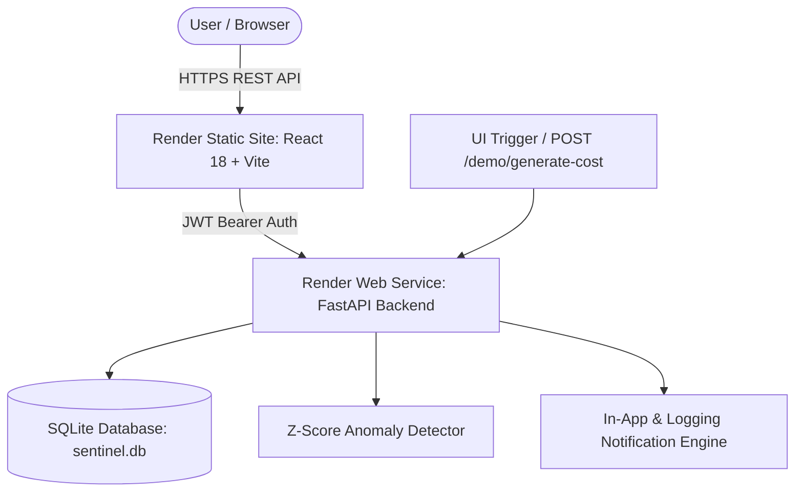

# CloudWatch Sentinel – Serverless Cloud Cost Monitoring & Alert System

**CloudWatch Sentinel** is a cloud-independent, production-ready serverless cloud cost monitoring and statistical anomaly detection platform. It evaluates multi-service cloud spending trends across Compute, Storage, Database, Network, API, and Other Cloud Services, calculates statistical Z-score cost anomalies, and alerts users to high-cost spending spikes.

Developed for the course **Cloud Application and Development**, this project is configured for zero-cost deployment on the **Render Cloud Platform** (Render Web Service + Render Static Site), with retained AWS Terraform IaC for future AWS deployment.

---

## Target Cloud Architecture (Render Deployment)



---

## Technical Stack

- **Backend**: Python 3.11+, FastAPI, Uvicorn, SQLite, PyJWT, Pytest
- **Frontend**: React 18, TypeScript 5, Vite 5, Recharts 2, Vanilla CSS (Dark Glassmorphism UI)
- **Cloud Deployment**: Render Free Tier (Render Web Service + Render Static Site)
- **Containerization**: Docker, Docker Compose
- **Original IaC Reference**: Terraform (AWS API Gateway, Cognito, DynamoDB, SNS, EventBridge, IAM)

---

## Quick Start & Local Demonstration

### 1. Backend Server
```powershell
# Install python dependencies
pip install -r backend/requirements.txt

# Start FastAPI backend (http://localhost:8000)
python -m uvicorn backend.main:app --host 0.0.0.0 --port 8000
```

### 2. Frontend Development Server
```powershell
cd frontend
npm install
npm run dev
```
Open `http://localhost:5173`.

### 3. Run Backend Unit Tests
```powershell
python -m pytest
```

---

## API Endpoints

- `GET /health`: Health check endpoint (`{"status": "healthy"}`).
- `POST /register`: Registers user credentials and returns JWT token.
- `POST /login`: Authenticates user and returns JWT token.
- `POST /confirm-registration`: Confirms account registration.
- `POST /connect-account`: Links Demo Cloud Account.
- `GET /dashboard` / `GET /summary`: Aggregates cost metrics, active anomalies, and account status.
- `GET /cost-history`: Returns service-level daily cloud spend.
- `GET /anomalies`: Lists calculated cost anomalies with Z-scores and severity levels (`CRITICAL`, `HIGH`, `MEDIUM`, `LOW`).
- `GET /alerts`: Returns in-app notification alerts.
- `POST /demo/generate-cost`: Generates realistic 30-day cloud cost updates and triggers Z-score anomaly evaluation.
- `POST /anomaly-preview`: Stateless Z-score anomaly preview calculator.

---

## Documentation Index

- [Architecture Guide](docs/ARCHITECTURE.md)
- [API Reference](docs/API.md)
- [Render & AWS Deployment Guide](docs/DEPLOYMENT.md)
- [Security Guide](docs/SECURITY.md)
- [Troubleshooting Guide](docs/TROUBLESHOOTING.md)
- [Interview & College Demo Q&A](docs/INTERVIEW_QUESTIONS.md)
