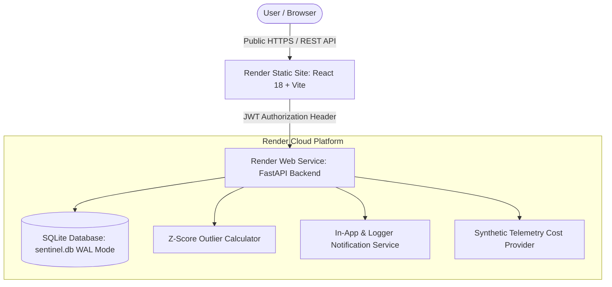

# System Architecture & Design – CloudWatch Sentinel

CloudWatch Sentinel is a cloud-independent, enterprise-grade cost monitoring, statistical anomaly detection, and telemetry platform deployed on the **Render Cloud Platform**.

---

## 🏛 System Architecture Overview

---

## 🧩 Subsystem Breakdown

### 1. Frontend Web Dashboard (`frontend/`)
- Built with React 18, TypeScript 5, Vite 5, Recharts 2, and a dark SaaS design system.
- Provides 7 dedicated views: Overview Dashboard, Cost Analytics, Cloud Resources, Anomalies Engine, Alerts & Notifications, System Health, and Settings.
- Interacts with backend via `import.meta.env.VITE_API_URL` environment variables.

### 2. FastAPI Backend API Service (`backend/`)
- Powered by FastAPI and Uvicorn ASGI server listening on `0.0.0.0:${PORT}`.
- Exposes RESTful endpoints for authentication, cost telemetry, anomaly calculations, health monitoring, and demo simulations.
- Enforces dynamic CORS rules matching `FRONTEND_URL`.

### 3. SQLite Database Repository (`backend/shared/repository.py`)
- Auto-initializes schema on startup with Write-Ahead Logging (`PRAGMA journal_mode=WAL`) and 60-second connection timeouts.
- Tables:
  - `users`: User profiles and hashed credentials.
  - `accounts`: Connected cloud account metadata.
  - `cost_history`: Service-level daily cloud expenditure.
  - `anomalies`: Flagged cost spikes with calculated Z-scores.
  - `notifications`: Alert notification items.

### 4. Z-Score Statistical Anomaly Engine (`backend/anomaly/detector.py`)
- Evaluates per-service daily spend using population Z-score standard deviation calculations:
  $$Z = \frac{X - \mu}{\sigma}$$
- Severity rules:
  - `CRITICAL`: $Z \ge 4.0$
  - `HIGH`: $3.0 \le Z < 4.0$
  - `MEDIUM`: $2.0 \le Z < 3.0$
  - `LOW`: $Z < 2.0$

### 5. Ephemeral Filesystem Cold-Start Resilience
- Render Free Tier container filesystems reset upon redeployment or cold restarts.
- FastAPI's `@asynccontextmanager` `lifespan` handler automatically initializes `sentinel.db` and seeds baseline 30-day cloud cost metrics and Z-score anomalies if empty, ensuring instant application availability.
