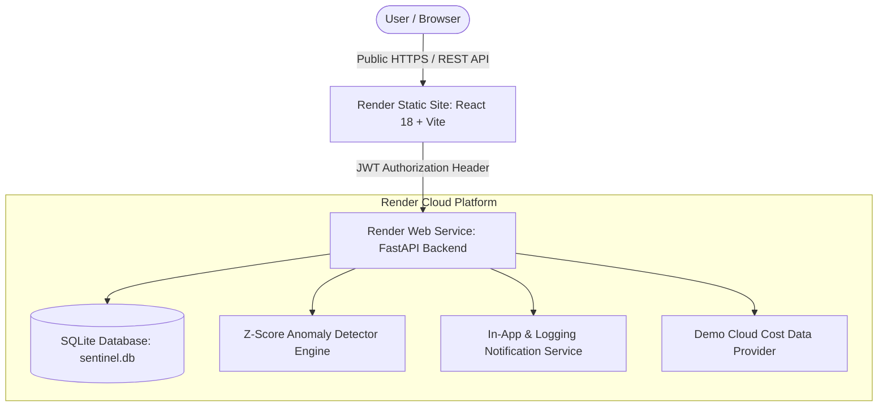

# System Architecture & Design – CloudWatch Sentinel

CloudWatch Sentinel is a production-grade, cloud-independent cost monitoring and statistical anomaly detection application deployed on the **Render Cloud Platform**.

---

## High-Level System Architecture

---

## Core Components

### 1. Render Static Site (Frontend UI)
- Hosted on Render Static Sites with custom domain / public HTTPS URL (`https://cloudwatch-sentinel-ui.onrender.com`).
- Single Page Application built using React 18, TypeScript 5, Vite 5, Recharts 2, and Vanilla CSS.
- Communicates with the backend using the environment variable `VITE_API_URL`.

### 2. Render Web Service (FastAPI Backend API)
- Hosted on Render Web Services listening on `0.0.0.0:${PORT}`.
- Provides RESTful routes for authentication (`/register`, `/login`, `/confirm-registration`), cost metrics (`/cost-history`), dashboard metrics (`/dashboard`, `/summary`), anomalies (`/anomalies`), notifications (`/alerts`), demo update generation (`/demo/generate-cost`), and health check (`/health`).
- Exposes CORS headers dynamically configured via `FRONTEND_URL`.

### 3. SQLite Database Repository (`backend/shared/repository.py`)
- Auto-initializes schema on startup with WAL journal mode (`PRAGMA journal_mode=WAL`) and 60-second connection timeouts.
- Tables:
  - `users`: User profiles and hashed passwords.
  - `accounts`: Connected account details (`userId`, `accountName`, `roleArn`, `externalId`).
  - `cost_history`: Service-level daily cloud spend.
  - `anomalies`: Detected cost spikes (`baseline`, `zScore`, `severity`).
  - `notifications`: Alert notifications.

### 4. Statistical Anomaly Detector Engine (`backend/anomaly/detector.py`)
- Evaluates per-service daily spend using a rolling population Z-score calculation:
  $$Z = \frac{X - \mu}{\sigma}$$
  Where $X$ is current daily spend, $\mu$ is baseline mean, and $\sigma$ is baseline standard deviation.
- Severity levels:
  - **Medium**: $2.0 \le Z < 3.0$
  - **High**: $3.0 \le Z < 4.0$
  - **Critical**: $Z \ge 4.0$ (or standard deviation is 0 with a spike)

### 5. Demo Cloud Cost Data Provider (`backend/cost/service.py`)
- Generates 30+ days of historical daily cloud spending across:
  - Compute Services
  - Storage Services
  - Database Services
  - Network & CDN
  - API & Gateways
  - Other Cloud Services
- Injects realistic cost spikes (e.g. Compute Services jumping from $50 to $185.40) to demonstrate automated anomaly detection.

---

## Original AWS Architecture Reference (Retained IaC)

The repository retains full Terraform configuration (`terraform/main.tf`) as an optional future deployment architecture for AWS:
- AWS API Gateway HTTP API + Cognito User Pool
- AWS Lambda functions (`sentinel-api`, `sentinel-collector`)
- 5 DynamoDB On-Demand Tables
- EventBridge 6-hour scheduler
- Amazon SNS Email Notifications
